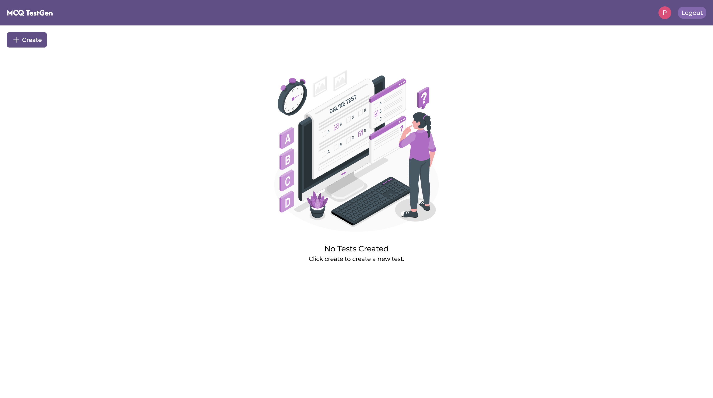
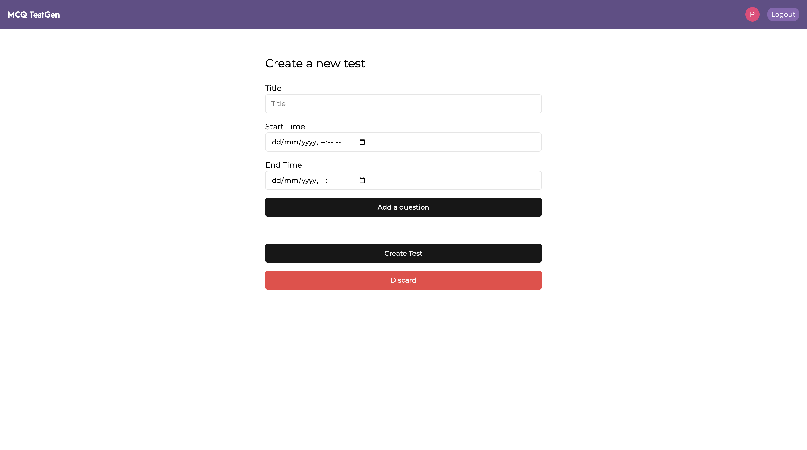

# MCQ TestGen

Welcome to the MCQ TestGen. This application allows users to create, share, and manage multiple-choice question (MCQ) tests, including start and end times. Additionally, it provides functionality to view test results and track submissions.




## Features

- **Create Tests**: Create your own MCQ tests with ease, adding questions and answer options.

- **Set Time**: Specify start and end times for each test.

- **Share Tests**:: Distribute your tests with others via unique links.

- **Track Results**: View detailed results, including which users submitted their tests and their scores.

## Demo

[https://](#)

## Installation

Clone the repository:

```bash
git clone https://github.com/piyush-rawat/mcq-testgen.git
```

Navigate to the project directory

```bash
cd mcq-testgen
```

### Configuration

Create a .env file: In the root directory of your project, create a file named .env. This file will hold your environment variables.

```bash
PORT=
MONGODB_URI=
```

Install the dependencies

```bash
npm install && npm install --prefix FRONTEND
```

Run the project

```bash
npm run dev
```

## Usage

- **Create a Test**: Log in and navigate to the "Create Test" section to start designing your MCQ test.
- **Set Timers**: While creating a test, specify the start and end times in the provided fields.
- **Share the Test**: After creating a test, use the generated link to share it with others.
- **View Results**: Access the "View Results" section to see who has submitted the test and their scores.

## Technologies and Frameworks Used

- **Frontend**: React.js / Tailwindcss
- **Backend**: Node.js / Express.js
- **Database**: MongoDB
- **Deployment**: Render [https://render.com](#)
